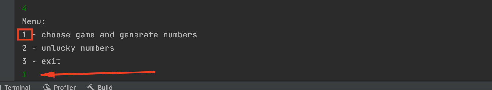

# Generator für Lottozahlen

## Beschreibung

Diese kleine Java-Anwendung hilft, eine Tippreihe für Lottery wie Lotto(6aus49) und Eurojackpot(5aus50 und 2aus10) 
zu generieren und hat gleichzeitig die Möglichkeit, die Unglückszahlen des Benutzers zu berücksichtigen. 
Bei der Eingabe von Unglückszahlen kann es sein, dass der Benutzer eine Fehlermeldung erhält, 
wenn die Zahlen für die Art des Spiels falsch sind. Diese Anwendung hat die Funktion, 
Daten (Unglückszahlen) auch nach Beendigung der Anwendung zu speichern. 
Sie werden in Textdateien gespeichert, die auch in der Anwendung bereitgestellt werden.
---
## Einstig
1. Um die Anwendung auszuführen, müssen Sie herunterladen [java](https://www.oracle.com/de/java/technologies/javase/jdk11-archive-downloads.html) und auf Ihrem Computer installieren
2. Laden Sie die [Entwicklungsumgebung IntelliJ IDEA](https://www.jetbrains.com/idea/download/#section=mac) auf Ihren Computer herunter
3. Öffnen Sie die Entwicklungsumgebung und erstellen Sie ein leeres Projekt
4. Öffnen Sie das Terminal (wenn Sie Mac-OS haben) und fügen Sie die Zeile ein: 
   
   ```git clone https://github.com/marinamitunevich/Generation_betting_series.git ```
5. Wenn Sie ein Betriebssystem Windows verwenden, müssen Sie eine Git-Bash installieren und mit Idea verbinden

### Spielanleitung
1. Nachdem Sie diese Anwendung in die IntelliJ IDEA geklont haben, können Sie das Programm starten, indem Sie auf die Schaltfläche Programmstart klicken.
   In der Konsole sehen Sie das Startmenü.

2. Um zum Menü der unglücklichen Nummern zu wechseln, wählen Sie die Befehl 2.

3. Wählen Sie als Befehl 1, wenn Sie unglückliche Zahlen hinzufügen möchten, oder Befehl 2 und 3 für andere Aktionen.

4. Als nächstes werden Sie aufgefordert, die unglücklichen Zahlen durch ein Leerzeichen getrennt einzugeben.

5. Dies ist ein Beispiel für eine Fehlermeldung. Wenn Sie ungültige Zahlen eingeben, können Sie weiterhin Zahlen eingeben.

6. Nach Eingabe der unglücklichen Zahlen für alle Spiele leitet die Anwendung zum Startmenü weiter. Um ein Spiel auszuwählen, drücken Sie Befehl 1.

7. Sie gehen zum Spielauswahlmenü. Wählen Sie dazu Befehl 1 oder 2, kehren Sie zum Startmenü zurück Befehl 1

8. Hier sehen wir ein Beispiel für die Generierung einer Tippreihe für das Spiel Lotto(6aus49).


### Beschreibungen von Dateien und Klassen
### menu
1. LotteryApplication.java: 
Das ist der Einstigspunkt für die Ausführung. Es enthält Klassenobjekt MainMenu und Methodenaufruf showMenu(), die verwendet wird, 
um das Startmenü zu erstellen.
2. ApplicationContext.java:
   enum-Klasse, die ein Feld INSTANCE enthält, mit dem nur ein Objekt dieser Klasse während des Betriebs der Anwendung erstellt wird. Und wir können auf in dieser Klasse initialisierte Objekte zugreifen.
3. Menu.java:
   Das ist ein Interface, die die Methode showMenu() enthält
4. BaseMenu.java
   es ist eine abstrakte Klasse, die das Menu Interface implementiert und 
   eine eigene Methode exit() enthält
5. MainMenu.java:
   eine Klasse, die von der BaseMenu erbt und die showMenu()-Methode überschreibt. 
   Diese Methode zeigt das StartMenu zur Auswahl eines weiteren Schritts an.
6. UnluckyNumbersMenu.java:
   eine Klasse, die von der BaseMenu erbt und die showMenu()-Methode überschreibt. 
   Diese Methode enthält Code zum Implementieren eines Menüs (Auswählen von Aktionen 
   mit Unglückszahlen): zahlen hinzufügen, Zahlen entfernen, zurück zum Startmenü.
7. GameNamesMenu.java:
   eine Klasse, die von der BaseMenu erbt und die showMenu()-Methode überschreibt. 
   Die Methode enthält den Code für die Implementierung der Spielauswahl und die anschließende 
   Generierung einer Tippreihe.
### api
1. Lottery.java:
   das Interface, die Methoden enthält: generateNumbers() getLotteryName(), die auch Interface UnluckyNumbers erbt.
2. UnluckyNumbers.java
   das Interface, die Methoden enthält: addLuckyNumbers() getLuckyNumbers() removeLuckyNumbers().
3. BaseLottery.java:
   es ist eine abstrakte Klasse, die das Lottery Interface implementiert
   und schreibt alle seine Methoden und Methode von UnluckyNumbers über. Diese Methoden enthalten Code, um Dateien unglückliche Zahlen hinzuzufügen, diese Zahlen aus Dateien zu lesen und die unglücklichen Zahlen zu berücksichtigen, wenn eine Tippreihe von Zahlen generiert wird, Zahlen aus Dateien entfernt und der Name des Spiels abgerufen wird.
4. LottoLottery.java:
   eine Klasse, die von der BaseLottery erbt.
   Über den Konstruktor übergibt die Klasse ihre Daten an die Felder der Elternklasse und verwendet die Methoden der Elternklasse.
5. EuroJackPotLottery.java:
   es ist eine Klasse, die das Lottery Interface implementiert.
   Diese Klasse nicht von der Klasse BaseLottery erbt im Gegensatz zu anderen Klassen.
   Sie schreibt alle Methoden des Interfaces Lottery und UnluckyNumbers über. 
   Diese Klasse hat ein anderes Verhalten als die Klasse BaseLottery. 
   Dementsprechend implementiert die Klasse Interface-Methoden auf andere Weise.
   Genauer gesagt bezieht sich die Klasse in diesen Methoden auf Objekte EuroJackPot2From10, EuroJackPot5From50 und ruft ihre Methoden auf.
6. EuroJackPot2From10.java:
   eine Klasse, die von der BaseLottery erbt.
   Über den Konstruktor übergibt die Klasse ihre Daten an die Felder der Elternklasse und verwendet die Methoden der Elternklasse.
7. EuroJackPot5From50.java:
   eine Klasse, die von der BaseLottery erbt.
   Über den Konstruktor übergibt die Klasse ihre Daten an die Felder der Elternklasse und verwendet die Methoden der Elternklasse.
